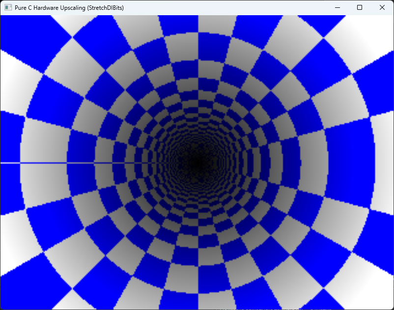
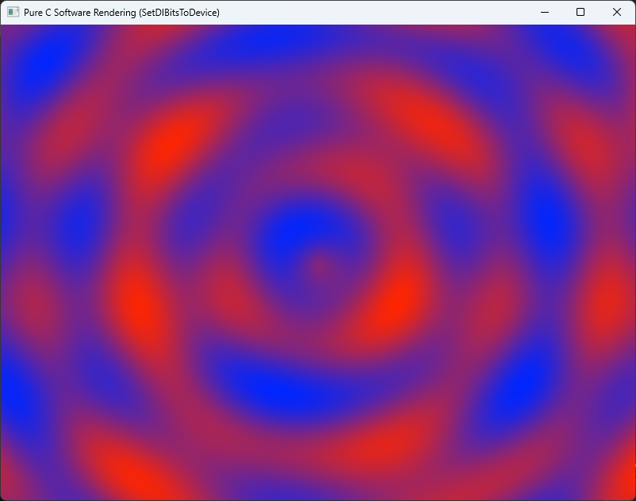

# WinCore

A cross-platform windowing and graphics abstraction framework written in **C++98** for maximum portability. The framework exposes **C89** header files, ensuring backward compatibility and simplifying the creation of language bindings.

**WinCore** provides a **hardware/software emulation layer for the Win32 sub-system**. This allows legacy, procedural C/C++ Windows applications (utilizing a standard window procedure callback and a `GetMessage`/`DispatchMessage` loop) to compile natively on non-Windows platforms like Linux and macOS without modifying the core codebase.

Under the hood, WinCore intercepts classical Win32 entry-points and routes them through cross-platform rendering backends: **SDL3**, **SDL2**, or a headless **NULL** system.

---

## Project Status & Roadmap

⚠️ **Project Status:** This framework is currently under active development. Core Win32 emulation and OpenGL context switching are functional, but specific API entry-points are still being implemented.

### Future Subsystem Backends:
- **SDL1 Backend:** Planned to target vintage legacy hardware and resource-constrained environments.
- **XLib Backend:** Planned for native Linux/Unix environments to provide lightweight execution paths independent of third-party media libraries.

---

## Core Concept

The philosophy of **WinCore** is to use the classic Win32 API as a cross-platform compatibility layer.

Instead of rewriting time-tested procedural C/C++ rendering logic for modern abstract APIs, WinCore transforms legacy Windows patterns into standard middleware. This allows historically platform-locked codebases to migrate and run across modern software environments and hardware form factors.

---

## Scope & Architectural Focus

To ensure lightweight execution and clean maintenance, **WinCore does not aim to emulate the entire Win32 API surface**. Instead, it targets the essential multimedia and game-loop sub-systems required to run performance-focused 2D and 3D engines.

### Supported & Planned Sub-systems:
- **Core Abstraction Layer (Implemented):** Window lifecycles (`HWND`), system events, message loops (`MSG`), device input polling (mouse/keyboard), and paint-cycle handling (`BeginPaint`/`EndPaint`/`InvalidateRect`).
- **3D Graphics Layer (Implemented):** Modern and legacy **OpenGL** device context integration (`HDC`, `HGLRC`, `WGL`).
- **Software 2D Graphics Layer (Implemented):** GDI bitmap blitting (`SetDIBitsToDevice`, `StretchDIBits`) with hardware-accelerated presentation via SDL textures.
- **Modern Compute Layer (Roadmap):** Native **Vulkan** surface initialization bridge.
- **Legacy 2D Graphics Layer (Roadmap):** Full **GDI** software pixel pipelines and **DirectDraw** surfaces for classic sprite-based software.
- **Audio Sub-system (Roadmap):** Low-level **DirectSound** buffer management and hardware mixer emulation.

---

## The Idea

WinCore is not only a compatibility layer for legacy code. It is a deliberate choice of **foundation** for new software.

Modern multimedia libraries — SDL, GLFW, raylib — are excellent, but their APIs evolve. Functions get deprecated, renamed, restructured. A project written against SDL2 today may need porting work tomorrow for SDL3, and again for whatever comes next. Each library brings its own idioms, its own lifetime rules, its own event model.

**Win32 does not change.**

The procedural Win32 API has been stable for over three decades. Its function signatures, message constants, window lifecycle, and event model are effectively frozen — not by accident, but because an entire generation of software depends on them. That stability is not a limitation. It is an asset.

WinCore treats this frozen surface as a **portable substrate**. By targeting Win32 semantics instead of a moving library API, you get:

- **Longevity.** Code written against WinCore today will compile tomorrow, regardless of which rendering backend is fashionable.
- **Portability.** The same source runs on Windows natively (via real Win32) and on Linux/macOS (via WinCore). No `#ifdef` trees, no per-platform abstraction layers.
- **Interoperability.** Decades of documentation, tutorials, books, and Stack Overflow answers about Win32 apply directly.
- **Language agnosticism.** C89 headers with a flat procedural ABI make bindings to C++, Rust, Zig, D, Python, and anything else with a C FFI straightforward.
- **Zero vendor lock-in.** Backends are swappable. SDL3 today, SDL1 or XLib tomorrow, NULL for tests. Your application code does not change.

This is not nostalgia. It is engineering pragmatism.

You can write a brand-new game, tool, or engine against WinCore with confidence that the foundation will not shift under your feet. The ecosystem around it may move — WinCore does not.

---

### Implemented WinAPI Functions (C89 Headers)

#### ⚙️ Kernel32.dll
```c
WINCORE_API HMODULE LoadLibraryA(LPCSTR lpLibFileName);
WINCORE_API BOOL FreeLibrary(HMODULE hLibModule);
WINCORE_API FARPROC GetProcAddress(HMODULE hModule, LPCSTR lpProcName);
WINCORE_API DWORD GetTickCount(void);
WINCORE_API void Sleep(DWORD dwMilliseconds);
```

#### 🖼️ User32.dll
```c
WINCORE_API HMODULE GetModuleHandleA(LPCSTR lpModuleName);
WINCORE_API HBRUSH GetSysColorBrush(int nIndex);
WINCORE_API ATOM RegisterClassA(const WNDCLASSA* lpWndClass);
WINCORE_API HWND CreateWindowExA(DWORD dwExStyle, LPCSTR lpClassName, LPCSTR lpWindowName, DWORD dwStyle, int X, int Y, int nWidth, int nHeight, HWND hWndParent, HMENU hMenu, HINSTANCE hInstance, LPVOID lpParam);
WINCORE_API BOOL DestroyWindow(HWND hWnd);
WINCORE_API BOOL GetMessageA(LPMSG lpMsg, HWND hWnd, UINT wMsgFilterMin, UINT wMsgFilterMax);
WINCORE_API BOOL PeekMessageA(LPMSG lpMsg, HWND hWnd, UINT wMsgFilterMin, UINT wMsgFilterMax, UINT wRemoveMsg);
WINCORE_API void PostQuitMessage(int nExitCode);
WINCORE_API LRESULT DefWindowProcA(HWND hWnd, UINT Msg, WPARAM wParam, LPARAM lParam);
WINCORE_API LRESULT DispatchMessageA(const MSG* lpMsg);
WINCORE_API BOOL TranslateMessage(const MSG* lpMsg);
WINCORE_API HDC GetDC(HWND hWnd);
WINCORE_API int ReleaseDC(HWND hWnd, HDC hDC);
WINCORE_API BOOL GetClientRect(HWND hWnd, LPRECT lpRect);
WINCORE_API BOOL ShowWindow(HWND hWnd, int nCmdShow);
WINCORE_API BOOL UpdateWindow(HWND hWnd);
WINCORE_API BOOL GetWindowRect(HWND hWnd, LPRECT lpRect);
WINCORE_API BOOL GetCursorPos(LPPOINT lpPoint);
WINCORE_API BOOL SetCursorPos(int x, int y);
WINCORE_API int ShowCursor(BOOL bShow);
WINCORE_API SHORT GetAsyncKeyState(int vKey);
WINCORE_API BOOL SetWindowText(HWND hWnd, LPCSTR lpString);
WINCORE_API HDC BeginPaint(HWND hWnd, LPPAINTSTRUCT lpPaint);
WINCORE_API BOOL EndPaint(HWND hWnd, const PAINTSTRUCT* lpPaint);
WINCORE_API BOOL InvalidateRect(HWND hWnd, const RECT* lpRect, BOOL bErase);
```

#### 🎨 Gdi32.dll
```c
WINCORE_API int ChoosePixelFormat(HDC hdc, const PIXELFORMATDESCRIPTOR* ppfd);
WINCORE_API BOOL SetPixelFormat(HDC hdc, int format, const PIXELFORMATDESCRIPTOR* ppfd);
WINCORE_API BOOL SwapBuffers(HDC hdc);
WINCORE_API int SetDIBitsToDevice(HDC hdc, int xDest, int yDest, DWORD wDest, DWORD hDest, int xSrc, int ySrc, UINT uStartScan, UINT cScanLines, const void* lpvBits, const BITMAPINFO* lpbmi, UINT colorUse);
WINCORE_API int StretchDIBits(HDC hdc, int xDest, int yDest, int wDest, int hDest, int xSrc, int ySrc, int wSrc, int hSrc, const void* lpBits, const BITMAPINFO* lpbmi, UINT iUsage, DWORD rop);
```

#### 🕹️ Opengl32.dll
```c
WINCORE_API HGLRC wglCreateContext(HDC hdc);
WINCORE_API BOOL wglMakeCurrent(HDC hdc, HGLRC hglrc);
WINCORE_API BOOL wglDeleteContext(HGLRC hglrc);
WINCORE_API PROC wglGetProcAddress(LPCSTR unnamedParam1);
```

---

## Core Execution Model

Instead of including native Microsoft headers, applications link against WinCore. Legacy procedural entry-points compile and process identically across platforms:

```c
// This Win32/WGL procedural logic compiles natively on Linux and macOS using WinCore.
#include <stdio.h>
#include <WinCore/GL/GL.h>
#include <WinCore/Windows.h>

LRESULT CALLBACK WndProc(HWND hwnd, UINT msg, WPARAM wParam, LPARAM lParam) {
    switch (msg) {
        case WM_CREATE:
            printf("Window initialized successfully!\n");
            break;
        case WM_CLOSE:
            DestroyWindow(hwnd);
            break;
        case WM_DESTROY:
            PostQuitMessage(0);
            break;
    }
    return DefWindowProc(hwnd, msg, wParam, lParam);
}

int main(void) {
    WNDCLASS wc = {0};
    wc.lpfnWndProc = WndProc;
    wc.lpszClassName = "WinCoreDemoEngine";
    RegisterClass(&wc);

    HWND hwnd = CreateWindow(wc.lpszClassName, "WinCore Engine Framework",
                             WS_OVERLAPPEDWINDOW | WS_VISIBLE,
                             CW_USEDEFAULT, CW_USEDEFAULT,
                             800, 600, NULL, NULL, NULL, NULL);

    HDC hDC = GetDC(hwnd);
    HGLRC hRC = wglCreateContext(hDC);
    wglMakeCurrent(hDC, hRC);

    MSG msg;
    while (GetMessage(&msg, NULL, 0, 0)) {
        TranslateMessage(&msg);
        DispatchMessage(&msg);

        glClearColor(0.1f, 0.15f, 0.2f, 1.0f);
        glClear(GL_COLOR_BUFFER_BIT | GL_DEPTH_BUFFER_BIT);
        SwapBuffers(hDC);
    }

    wglMakeCurrent(NULL, NULL);
    wglDeleteContext(hRC);
    ReleaseDC(hwnd, hDC);

    return 0;
}
```

---

## Software 2D Rendering Example

WinCore also supports classical GDI software rendering through SetDIBitsToDevice and StretchDIBits, routed through an SDL streaming texture for hardware-accelerated presentation:

```c
#include <WinCore/Windows.h>
#include <stdlib.h>
#include <string.h>

#define VIRTUAL_WIDTH  320
#define VIRTUAL_HEIGHT 240

static DWORD*     g_pixels = NULL;
static BITMAPINFO g_bmi;
static HDC        g_hDC    = NULL;

LRESULT CALLBACK WndProc(HWND hwnd, UINT msg, WPARAM wParam, LPARAM lParam) {
    switch (msg) {
        case WM_CREATE:
            g_hDC = GetDC(hwnd);
            return 0;

        case WM_CLOSE:
            DestroyWindow(hwnd);
            return 0;

        case WM_DESTROY:
            if (g_hDC) { ReleaseDC(hwnd, g_hDC); g_hDC = NULL; }
            PostQuitMessage(0);
            return 0;

        case WM_PAINT: {
            PAINTSTRUCT ps;
            HDC paintDC = BeginPaint(hwnd, &ps);

            RECT rc;
            GetClientRect(hwnd, &rc);

            if (paintDC && g_pixels && rc.right > 0 && rc.bottom > 0) {
                StretchDIBits(paintDC,
                    0, 0, rc.right, rc.bottom,
                    0, 0, VIRTUAL_WIDTH, VIRTUAL_HEIGHT,
                    g_pixels, &g_bmi, DIB_RGB_COLORS, SRCCOPY);
            }

            EndPaint(hwnd, &ps);
            return 0;
        }

        case WM_ERASEBKGND:
            return 1;
    }
    return DefWindowProc(hwnd, msg, wParam, lParam);
}

int main(void) {
    WNDCLASS wc = {0};
    wc.lpfnWndProc   = WndProc;
    wc.lpszClassName = "WinCoreSoftwareClass";

    RegisterClass(&wc);

    HWND hwnd = CreateWindow(wc.lpszClassName, "WinCore Software Rendering",
                             WS_OVERLAPPEDWINDOW | WS_VISIBLE,
                             CW_USEDEFAULT, CW_USEDEFAULT,
                             800, 600, NULL, NULL, NULL, NULL);

    if (!hwnd) return 1;

    size_t bufferSize = (size_t)VIRTUAL_WIDTH * VIRTUAL_HEIGHT * sizeof(DWORD);
    g_pixels = (DWORD*)malloc(bufferSize);
    if (!g_pixels) return 1;

    memset(&g_bmi, 0, sizeof(BITMAPINFO));
    g_bmi.bmiHeader.biSize        = sizeof(BITMAPINFOHEADER);
    g_bmi.bmiHeader.biWidth       = VIRTUAL_WIDTH;
    g_bmi.bmiHeader.biHeight      = -VIRTUAL_HEIGHT; /* top-down */
    g_bmi.bmiHeader.biPlanes      = 1;
    g_bmi.bmiHeader.biBitCount    = 32;
    g_bmi.bmiHeader.biCompression = BI_RGB;

    MSG msg = {0};
    BOOL running = TRUE;

    while (running) {
        while (PeekMessage(&msg, NULL, 0, 0, PM_REMOVE)) {
            if (msg.message == WM_QUIT) { running = FALSE; break; }
            TranslateMessage(&msg);
            DispatchMessage(&msg);
        }

        if (!running) break;

        /* Fill g_pixels with a frame here. */

        InvalidateRect(hwnd, NULL, FALSE);
        UpdateWindow(hwnd);
    }

    free(g_pixels);
    return 0;
}
```

___

## Compilation Guidelines

The project uses CMake targeting a strict C++98 translation environment.

### Setting backend compilation targets:
```bash
mkdir build && cd build
cmake -DBACKEND_SDL3=ON ..   # Configure for the SDL3 backend
cmake --build .
```

On Windows builds, CMake triggers a `POST_BUILD` step to deploy the corresponding runtime components (`SDL2.dll` or `SDL3.dll`) to the output path based on the target architecture (x86/x64).

---

## Showcase Gallery

The images below demonstrate WinCore executing classical OpenGL 1.2 fixed-function pipeline techniques across platforms:

| Gouraud vs Flat Shading | Dynamic Spotlight |
| :---: | :---: |
|  |  |

| Textured 3D Cube | Vertex Arrays |
| :---: | :---: |
|  |  |

| GDI Upscaling | GDI RGB Buffer |
| :---: | :---: |
|  |  |

---

## Licensing

Copyright (C) 2026 Evgeny Zoshchuk (JordanCpp).  
Licensed under the terms of the **LGPL-3.0-or-later** license. Independent software vendors can link against this library without open-sourcing their application code, provided any modifications to the framework itself remain open-source.