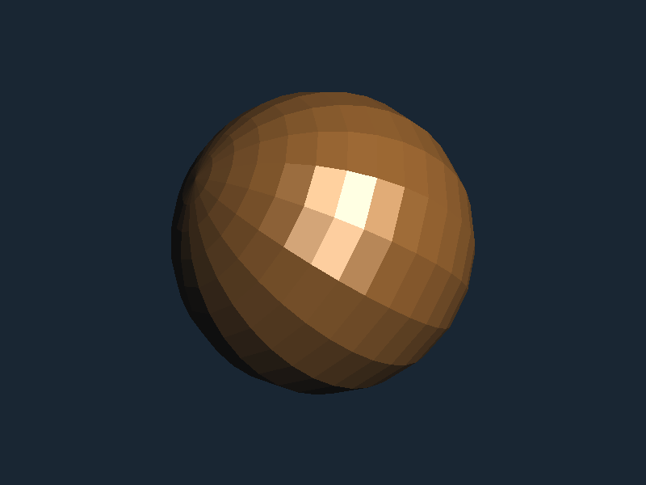
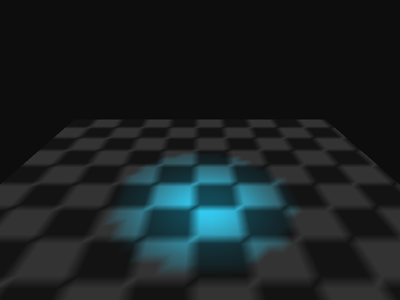
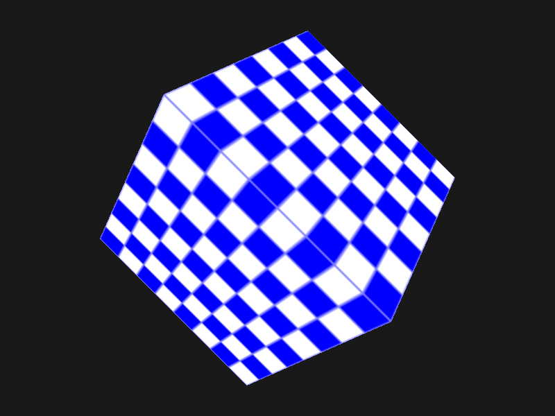
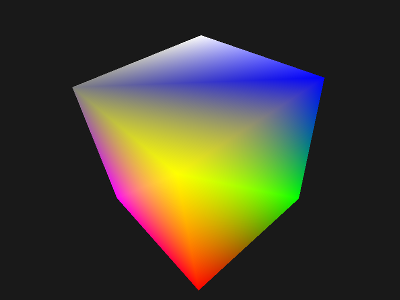

# WinCore

A cross-platform windowing and graphics abstraction framework written in **C++98** for maximum portability. The framework exposes **C89** header files, ensuring backward compatibility and simplifying the creation of language bindings.

**WinCore** provides a **hardware/software emulation layer for the Win32 sub-system**. This allows legacy, procedural C/C++ Windows applications (utilizing a standard window procedure callback and a `GetMessage`/`DispatchMessage` loop) to compile natively on non-Windows platforms like Linux and macOS without modifying the core codebase.

Under the hood, WinCore intercepts classical Win32 entry-points and routes them through cross-platform rendering backends: **SDL3**, **SDL2**, or a headless **NULL** system.

---

## Project Status & Roadmap

⚠️ **Project Status:** This framework is currently under active development. Core Win32 emulation and OpenGL context switching are functional, but specific API entry-points are still being implemented.

### Future Subsystem Backends:
- **SDL1 Backend:** Planned to target vintage legacy hardware and resource-constrained environments.
- **XLib Backend:** Planned for native Linux/Unix environments to provide lightweight execution paths independent of third-party media libraries.

---

## Core Concept

The philosophy of **WinCore** is to use the classic Win32 API as a cross-platform compatibility layer. 

Instead of rewriting time-tested procedural C/C++ rendering logic for modern abstract APIs, WinCore transforms legacy Windows patterns into standard middleware. This allows historically platform-locked codebases to migrate and run across modern software environments and hardware form factors.

---

## Scope & Architectural Focus

To ensure lightweight execution and clean maintenance, **WinCore does not aim to emulate the entire Win32 API surface**. Instead, it targets the essential multimedia and game-loop sub-systems required to run performance-focused 2D and 3D engines.

### Supported & Planned Sub-systems:
- **Core Abstraction Layer (Implemented):** Window lifecycles (`HWND`), system events, message loops (`MSG`), and device input polling (mouse/keyboard).
- **3D Graphics Layer (Implemented):** Modern and legacy **OpenGL** device context integration (`HDC`, `HGLRC`, `WGL`).
- **Modern Compute Layer (Roadmap):** Native **Vulkan** surface initialization bridge.
- **Legacy 2D Graphics Layer (Roadmap):** **GDI** software pixel pipelines and **DirectDraw** surfaces for classic sprite-based software.
- **Audio Sub-system (Roadmap):** Low-level **DirectSound** buffer management and hardware mixer emulation.

---

### Implemented WinAPI Functions (C89 Headers)

#### ⚙️ Kernel32.dll
```c
WINCORE_API HMODULE LoadLibraryA(LPCSTR lpLibFileName);
WINCORE_API BOOL FreeLibrary(HMODULE hLibModule);
WINCORE_API FARPROC GetProcAddress(HMODULE hModule, LPCSTR lpProcName);
WINCORE_API DWORD GetTickCount(void);
WINCORE_API void Sleep(DWORD dwMilliseconds);
```

#### 🖼️ User32.dll
```c
WINCORE_API HMODULE GetModuleHandleA(LPCSTR lpModuleName);
WINCORE_API HBRUSH GetSysColorBrush(int nIndex);
WINCORE_API ATOM RegisterClassA(const WNDCLASSA* lpWndClass);
WINCORE_API HWND CreateWindowExA(DWORD dwExStyle, LPCSTR lpClassName, LPCSTR lpWindowName, DWORD dwStyle, int X, int Y, int nWidth, int nHeight, HWND hWndParent, HMENU hMenu, HINSTANCE hInstance, LPVOID lpParam);
WINCORE_API BOOL DestroyWindow(HWND hWnd);
WINCORE_API BOOL GetMessageA(LPMSG lpMsg, HWND hWnd, UINT wMsgFilterMin, UINT wMsgFilterMax);
WINCORE_API BOOL PeekMessageA(LPMSG lpMsg, HWND hWnd, UINT wMsgFilterMin, UINT wMsgFilterMax, UINT wRemoveMsg);
WINCORE_API void PostQuitMessage(int nExitCode);
WINCORE_API LRESULT DefWindowProcA(HWND hWnd, UINT Msg, WPARAM wParam, LPARAM lParam);
WINCORE_API LRESULT DispatchMessageA(const MSG* lpMsg);
WINCORE_API BOOL TranslateMessage(const MSG* lpMsg);
WINCORE_API HDC GetDC(HWND hWnd);
WINCORE_API int ReleaseDC(HWND hWnd, HDC hDC);
WINCORE_API BOOL GetClientRect(HWND hWnd, LPRECT lpRect);
WINCORE_API BOOL ShowWindow(HWND hWnd, int nCmdShow);
WINCORE_API BOOL UpdateWindow(HWND hWnd);
```

#### 🎨 Gdi32.dll
```c
WINCORE_API int ChoosePixelFormat(HDC hdc, const PIXELFORMATDESCRIPTOR* ppfd);
WINCORE_API BOOL SetPixelFormat(HDC hdc, int format, const PIXELFORMATDESCRIPTOR* ppfd);
WINCORE_API BOOL SwapBuffers(HDC hdc);
WINCORE_API int SetDIBitsToDevice(HDC hdc, int xDest, int yDest, DWORD wDest, DWORD hDest, int xSrc, int ySrc, UINT uStartScan, UINT cScanLines, const void* lpvBits, const BITMAPINFO* lpbmi, UINT colorUse);
WINCORE_API int StretchDIBits(HDC hdc, int xDest, int yDest, int wDest, int hDest, int xSrc, int ySrc, int wSrc, int hSrc, const void* lpBits, const BITMAPINFO* lpbmi, UINT iUsage, DWORD rop);
```

#### 🕹️ Opengl32.dll
```c
WINCORE_API HGLRC wglCreateContext(HDC hdc);
WINCORE_API BOOL wglMakeCurrent(HDC hdc, HGLRC hglrc);
WINCORE_API PROC wglGetProcAddress(LPCSTR unnamedParam1);
```

---

## Core Execution Model

Instead of including native Microsoft headers, applications link against WinCore. Legacy procedural entry-points compile and process identically across platforms:

```c
// This Win32/WGL procedural logic compiles natively on Linux and macOS using WinCore.
#include <stdio.h>
#include <WinCore/GL/GL.h>
#include <WinCore/Windows.h>

LRESULT CALLBACK WndProc(HWND hwnd, UINT msg, WPARAM wParam, LPARAM lParam) {
    switch (msg) {
        case WM_CREATE:
            printf("Window initialized successfully!\n");
            break;
        case WM_DESTROY:
            PostQuitMessage(0);
            break;
    }
    return DefWindowProc(hwnd, msg, wParam, lParam);
}

int main(void) {
    WNDCLASS wc = {0};
    wc.lpfnWndProc = WndProc;
    wc.lpszClassName = "WinCoreDemoEngine";
    RegisterClass(&wc);

    HWND hwnd = CreateWindow(wc.lpszClassName, "WinCore Engine Framework", 
                             WS_OVERLAPPEDWINDOW, CW_USEDEFAULT, CW_USEDEFAULT, 
                             800, 600, NULL, NULL, NULL, NULL);

    HDC hDC = GetDC(hwnd);
    HGLRC hRC = wglCreateContext(hDC);
    wglMakeCurrent(hDC, hRC);

    MSG msg;
    while (GetMessage(&msg, NULL, 0, 0)) {
        TranslateMessage(&msg);
        DispatchMessage(&msg);

        glClearColor(0.1f, 0.15f, 0.2f, 1.0f);
        glClear(GL_COLOR_BUFFER_BIT | GL_DEPTH_BUFFER_BIT);
        SwapBuffers(hDC);
    }
    return 0;
}
```

---

## Compilation Guidelines

The project uses CMake targeting a strict C++98 translation environment.

### Setting backend compilation targets:
```bash
mkdir build && cd build
cmake -DBACKEND_SDL3=ON ..   # Configures compilation for SDL2 target
cmake --build .
```

On Windows builds, CMake triggers a `POST_BUILD` step to deploy the corresponding runtime components (`SDL2.dll` or `SDL3.dll`) to the output path based on the target architecture (x86/x64).

---

## Licensing

Copyright (C) 2026 Evgeny Zoshchuk (JordanCpp).  
Licensed under the terms of the **LGPL-3.0-or-later** license. Independent software vendors can link against this library without open-sourcing their application code, provided any modifications to the framework itself remain open-source.

---

## Showcase Gallery

The images below demonstrate WinCore executing classical OpenGL 1.2 fixed-function pipeline techniques across platforms:

| Gouraud vs Flat Shading | Dynamic Spotlight |
| :---: | :---: |
|  |  |

| Textured 3D Cube | Vertex Arrays |
| :---: | :---: |
|  |  |
